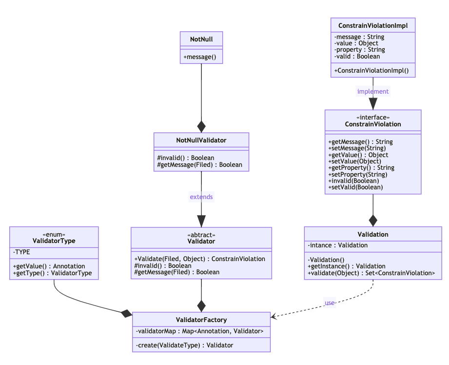

# Validation-Project

## THÔNG TIN NHÓM

### Nhóm 11 - Observable Pattern

| STT |  MSSV   | HỌ TÊN            |
| :-: | :-----: | :---------------- |
|  1  | 1712289 | Phan Lê Hoài Bảo  |
|  2  | 1712276 | Lương Hoàng Anh   |
|  3  | 1712673 | Nguyễn Hoàng Phúc |
|  4  | 1712708 | Vũ Duy Quang      |

## GIỚI THIỆU

- Dữ liệu nhập nhận được từ người dùng thông qua UI về bản chất từ thiết bị nhập chủ yếu là Keyboard nghĩa là dữ liệu kiểu chuỗi thuần. Dữ liệu để lưu trữ thì lại có nhiều kiểu dữ liệu khác nhau như: decimal, text,... bên cạnh đó là các ràng buộc cần thiết cho dữ liệu như: định dạng email, số điện thoại,.... Vì vậy nhu cầu data validation là luôn rất cần thiết cho dev. Hiện nay với các nền tảng đều có chứa Validation framework như ASP.NET, WPF, Winform,...
- Trong đồ án này, các nhóm sinh viên được yêu cầu tìm hiểu cấu trúc của các Validation framework, từ đó xây dựng cho mình một framework tương tự.

## CÁC CHỨC NĂNG CƠ BẢN TRONG FRAMEWORK

### Validation framework hỗ trợ các thao tác cơ bản:

1. Cơ chế thông báo khi data không valid

- Tổng hợp các thông báo
- Có các cách khác nhau để thể hiện thông báo trên giao diện

2. Thao tác thiết lập valid bằng code

- Tự kiểm tra với code thêm vào

3. Thao tác thiết lập valid tự động thông qua khai báo ràng buộc dữ liệu

- Ví dụ sử dụng attributes trong .NET

4. Có thể kết hợp các validation với nhau cho cùng kiểu dữ liệu

- Ví dụ: vừa thiết lập kiểm tra chuỗi rỗng, chuỗi chỉ toàn ký tự,…

5. Hỗ trợ kết hợp regular expression

6. Cho phép tạo custom validation

- Validation framework được xây dựng dựa trên các lớp đối tượng với các phương thức phù hợp.
- Có thể sử dụng reflection hoặc attribute (C#) hoặc annotation (Java) để đọc các thông tin mô tả ràng buộc các trường dữ liệu.
- Xây dựng các lớp cơ bản hỗ trợ validation cho các kiểu dữ liệu cơ bản.
- Xây dựng các lớp xử lý để thực hiện validation.

## SƠ ĐỒ LỚP THIẾT KẾ

