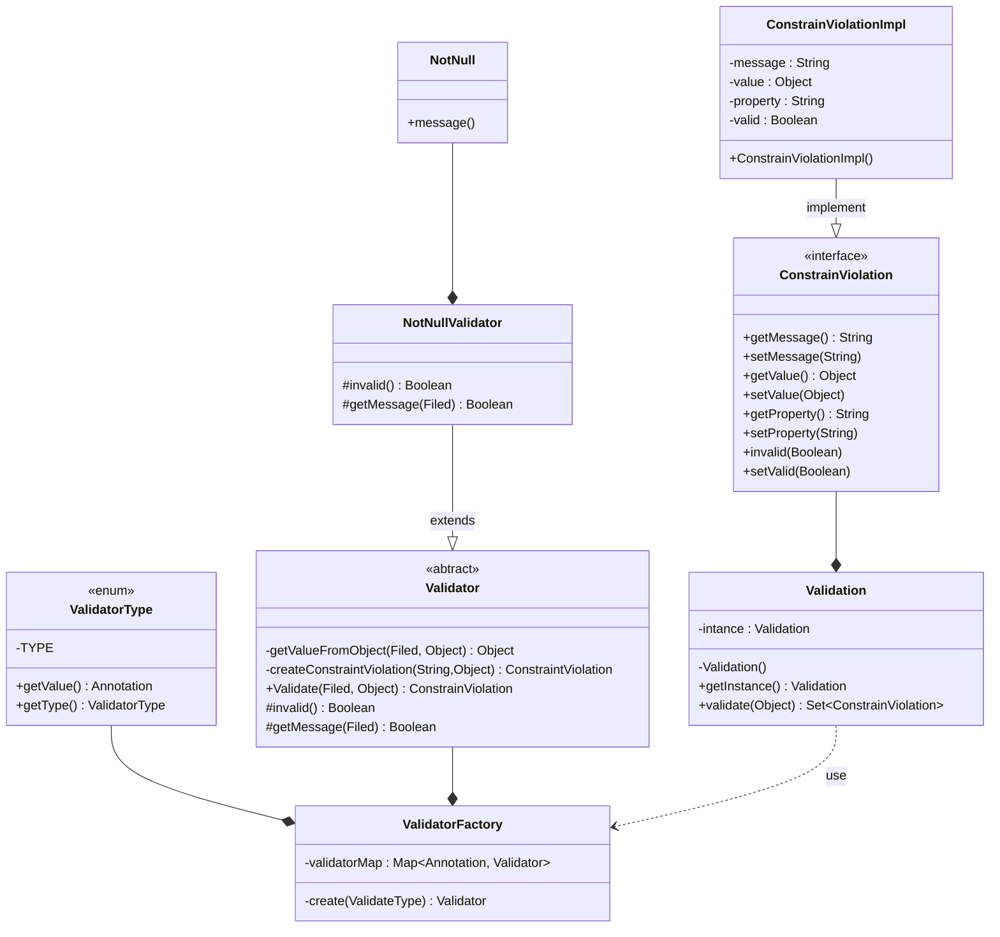

```mermaid
classDiagram
    %% ======================================================
    class Validation {
      -intance : Validation

      -Validation()
      +getInstance() Validation
      +validate(Object) Set~ConstrainViolation~
    }

    %% ======================================================
    class ConstrainViolation {
      +getMessage() String
      +setMessage(String)
      +getValue() Object
      +setValue(Object)
      +getProperty() String
      +setProperty(String)
      +invalid(Boolean)
      +setValid(Boolean)
    }
    <<interface>> ConstrainViolation

    %% ======================================================
    class ConstrainViolationImpl {
      -message : String
      -value : Object
      -property : String
      -valid : Boolean

      +ConstrainViolationImpl()
    }

    %% ======================================================
    class ValidatorFactory {
      -validatorMap : Map~Annotation, Validator~

      -create(ValidateType) Validator
    }

    %% ======================================================
    class ValidatorType {
      -TYPE

      +getValue() Annotation
      +getType() ValidatorType
    }
    <<enum>> ValidatorType

    %% ======================================================
    class Validator {
      -getValueFromObject(Filed, Object) Object
      -createConstraintViolation(String,Object) ConstraintViolation
      +Validate(Filed, Object) ConstrainViolation
      #invalid() Boolean
      #getMessage(Filed) Boolean
    }
    <<abtract>> Validator

    %% ======================================================
    class NotNullValidator {
      #invalid() Boolean
      #getMessage(Filed) Boolean
    }

    %% ======================================================
    class NotNull {
      +message()
    }

    %% ======================================================
    ConstrainViolation --* Validation
    ConstrainViolationImpl --|> ConstrainViolation : implement

    ValidatorType --* ValidatorFactory
    Validator --* ValidatorFactory
    NotNull --* NotNullValidator
    NotNullValidator --|> Validator : extends

    Validation ..> ValidatorFactory : use
```
